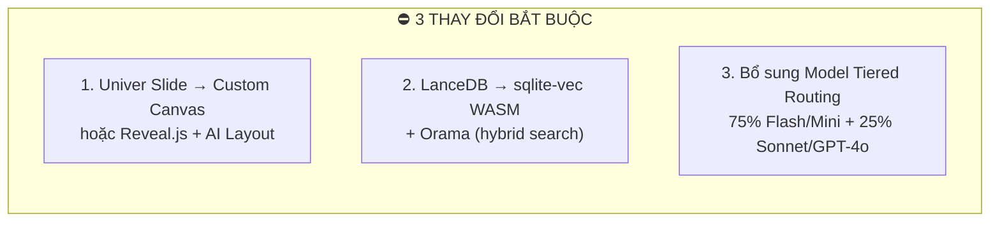
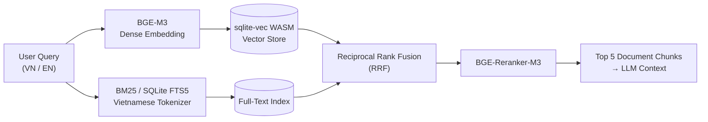
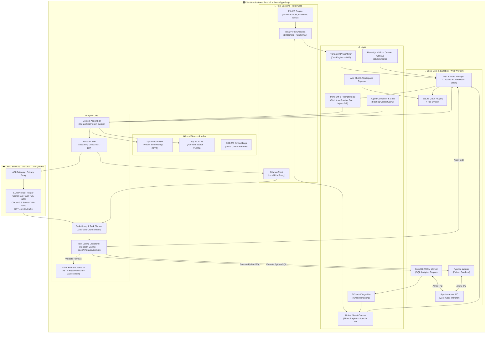
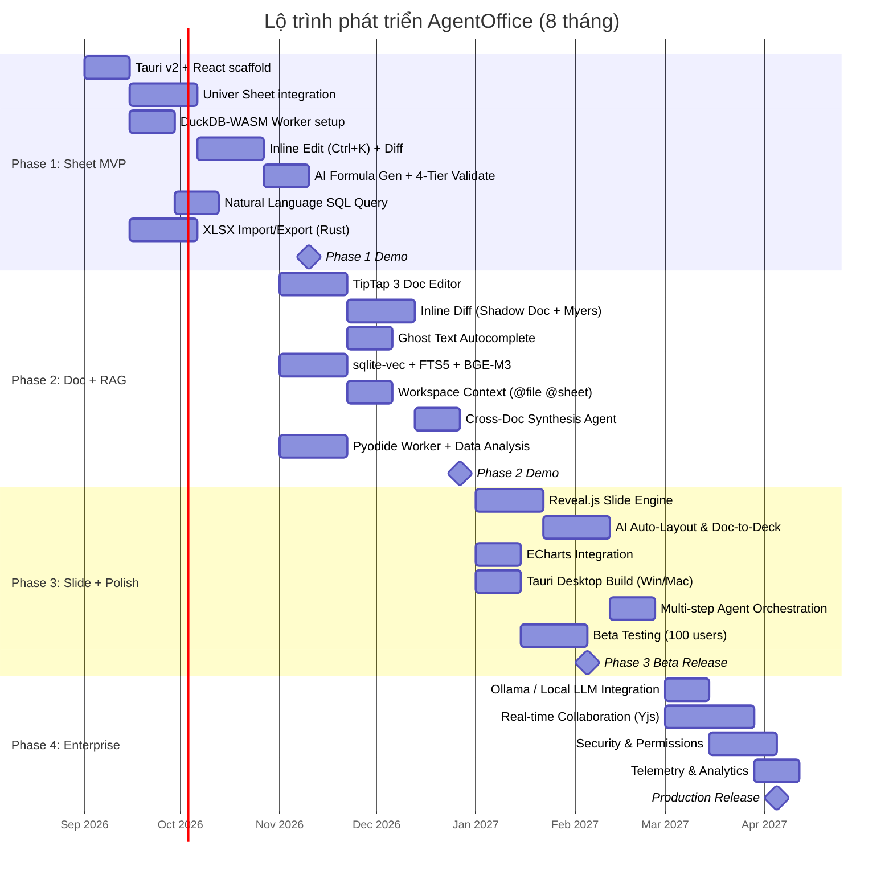

# 📊 BÁO CÁO NGHIÊN CỨU KHẢ THI & KIẾN TRÚC TRIỂN KHAI
## DỰ ÁN: AI-NATIVE AGENTIC OFFICE SUITE (AgentOffice)

* **Ngày phân tích:** `27/08/2026`
* **Phương pháp:** Nghiên cứu song song 5 nhóm chuyên sâu (Univer SDK, TipTap/ProseMirror, Tauri v2, WASM Sandbox, AI Agent Architecture)
* **Trạng thái:** `Hoàn tất nghiên cứu — Sẵn sàng triển khai`

---

## MỤC LỤC
1. [TỔNG QUAN ĐÁNH GIÁ](#1-tổng-quan-đánh-giá-executive-summary)
2. [ĐÁNH GIÁ CHI TIẾT TỪNG CÔNG NGHỆ](#2-đánh-giá-chi-tiết-từng-công-nghệ)
3. [THAY ĐỔI & BỔ SUNG SO VỚI PRD GỐC](#3-thay-đổi--bổ-sung-quan-trọng-so-với-prd-gốc)
4. [KIẾN TRÚC HỆ THỐNG TỐI ƯU](#4-kiến-trúc-hệ-thống-tối-ưu-revised)
5. [PHƯƠNG ÁN TRIỂN KHAI TỐT NHẤT](#5-phương-án-triển-khai-tốt-nhất)
6. [PHÂN TÍCH CHI PHÍ & MÔ HÌNH KINH DOANH](#6-phân-tích-chi-phí--mô-hình-kinh-doanh)
7. [MA TRẬN RỦI RO & GIẢM THIỂU](#7-ma-trận-rủi-ro--giảm-thiểu)
8. [LỘ TRÌNH TRIỂN KHAI THỰC TẾ](#8-lộ-trình-triển-khai-thực-tế-revised)
9. [QUYẾT ĐỊNH KỸ THUẬT CẦN XÁC NHẬN](#9-quyết-định-kỹ-thuật-cần-xác-nhận)

---

## 1. TỔNG QUAN ĐÁNH GIÁ (EXECUTIVE SUMMARY)

### 1.1. Kết luận chính

> [!IMPORTANT]
> **Dự án AgentOffice là KHẢ THI về mặt kỹ thuật** với tổng điểm khả thi **90/100**. Tuy nhiên, có **3 điều chỉnh quan trọng** cần thực hiện so với PRD gốc để đảm bảo thành công.

### 1.2. Bảng đánh giá tổng quan Stack công nghệ

| Thành phần | Công nghệ PRD đề xuất | Đánh giá thực tế | Điểm khả thi | Khuyến nghị |
| :--- | :--- | :--- | :---: | :--- |
| **Bảng tính** | Univer Sheet (Apache 2.0) | ⭐ **Xuất sắc** — 6M+ ô @ 60 FPS, 500+ hàm Excel | **98%** | ✅ **GIỮ NGUYÊN** |
| **Soạn thảo Văn bản** | TipTap/ProseMirror (MIT) | ⭐ **Xuất sắc** — JSON AST, Yjs collab, AI-friendly | **95%** | ✅ **GIỮ NGUYÊN** |
| **Trình chiếu** | Univer Slide | ⚠️ **CHƯA SẴN SÀNG** — Thử nghiệm, thiếu tính năng | **30%** | ⛔ **THAY ĐỔI CHIẾN LƯỢC** |
| **Desktop App** | Tauri v2 (Rust) | ⭐ **Xuất sắc** — 5-15MB, 30-60MB RAM, đa nền tảng | **95%** | ✅ **GIỮ NGUYÊN** |
| **Code Sandbox** | DuckDB-WASM + Pyodide | ⭐ **Rất tốt** — Sub-giây cho 1M dòng, pandas/numpy | **93%** | ✅ **GIỮ NGUYÊN** (cần tối ưu khởi tạo) |
| **Vector Search** | LanceDB | ⚠️ **KHÔNG CHẠY ĐƯỢC trong browser** | **20%** | ⛔ **THAY THẾ** bằng sqlite-vec/Orama |
| **AI Agent** | ReAct Loop + Function Calling | ⭐ **Rất tốt** — Kiến trúc proven từ Cursor/Windsurf | **92%** | ✅ **GIỮ NGUYÊN** + bổ sung tiered routing |

### 1.3. Ba thay đổi bắt buộc



---

## 2. ĐÁNH GIÁ CHI TIẾT TỪNG CÔNG NGHỆ

### 2.1. Univer SDK — Bảng tính (⭐ LỰA CHỌN SỐ 1)

> [!TIP]
> Univer Sheet là công nghệ bảng tính web mạnh nhất hiện tại, vượt trội hoàn toàn so với Handsontable, Luckysheet, và FortuneSheet.

**Điểm mạnh đã xác minh:**

| Khía cạnh | Chi tiết |
| :--- | :--- |
| **Hiệu năng** | Canvas2D Virtual Scrolling — **6M+ ô @ 60 FPS** (test trên i9-13900H). Viewport culling + Dirty-region rendering |
| **Formula Engine** | **500+ hàm Excel** (vượt claim 300+ trong PRD). Hỗ trợ `XLOOKUP`, `LAMBDA`, `LET`, Dynamic Arrays, Circular detection |
| **API cho AI Agent** | Facade API (`univerAPI`) + JSON Snapshot Model (`IWorkbookData`). AI có thể đọc/ghi programmatically qua `setValues()`, `setCellContents()`, event listeners |
| **License** | Apache 2.0 — An toàn 100% cho thương mại hóa |
| **TypeScript** | 100% strict TypeScript, tích hợp React 18/19 |
| **Version** | v0.25.1 (approaching 1.0.0) — Pre-1.0 nhưng Sheet rất ổn định |

**Rủi ro cần lưu ý:**

| Rủi ro | Mức độ | Giải pháp |
| :--- | :---: | :--- |
| API churn giữa minor versions | 🟡 Trung bình | Pin exact version, theo dõi changelog |
| Charts/Pivot Tables yêu cầu **Univer Pro (trả phí)** | 🟠 Cao | Tích hợp ECharts/Vega-Lite riêng cho charts. Pivot Table tự build hoặc mua license |
| Excel Import/Export lossless cần **Univer Pro** | 🟠 Cao | Dùng crate Rust `calamine` + `rust_xlsxwriter` qua Tauri IPC (xem mục 4) |
| DI Architecture phức tạp cho custom plugins | 🟡 Trung bình | Ưu tiên dùng Facade API, chỉ deep-dive DI khi cần thiết |
| Collaboration server cần **Univer Pro** | 🟡 Trung bình | Phase 1-3 không cần collab. Phase 4+ đánh giá lại hoặc build custom OT/Yjs |

---

### 2.2. TipTap/ProseMirror — Soạn thảo Văn bản (⭐ LỰA CHỌN HÀNG ĐẦU)

> [!TIP]
> TipTap 3 (trên nền ProseMirror) là nền tảng soạn thảo web được sử dụng bởi NY Times, Atlassian, GitLab, Linear, và OpenAI Canvas.

**Điểm mạnh đã xác minh:**

| Khía cạnh | Chi tiết |
| :--- | :--- |
| **JSON AST** | Document tree dạng Node/Mark — AI có thể đọc `getJSON()`, output Markdown, hoặc modify trực tiếp qua Transactions |
| **AI Integration** | TipTap 3 có **native AI Toolkit** — `addJsonSchemaAwareness`, streaming edit support, schema migration |
| **Real-time Collab** | **Yjs + Hocuspocus** — Best-in-class CRDT. Open-source, self-hosted |
| **Tables** | `prosemirror-tables` — Industry standard (merge/split cells, resize, row/col spanning) |
| **Diff & Track Changes** | `prosemirror-changeset` (open-source), `@tiptap-pro/extension-tracked-changes` (paid) |
| **DOCX Export** | `prosemirror-docx` + `docx` npm library (open-source). Import via `mammoth.js` |
| **License** | MIT core — 100% free commercial. Pro features ($49-$149/mo) |

**Inline Diff Implementation cho AI Agent:**
```
Shadow Document Model:
┌──────────────────────────────┐    ┌──────────────────────────────┐
│     LiveDocument (Gốc)       │    │   StagedDocument (AI Edit)    │
│  "Doanh thu đạt 50 tỷ"       │    │  "Doanh thu vượt bậc 65 tỷ"  │
└──────────┬───────────────────┘    └──────────┬───────────────────┘
           │                                    │
           └──────── Myers Diff ───────────────┘
                         │
              ┌──────────▼──────────┐
              │ ProseMirror Decoration│
              │ .ai-diff-insertion   │ (xanh)
              │ .ai-diff-deletion    │ (đỏ)
              └──────────┬──────────┘
                         │
              [Tab] Accept → Commit transaction
              [Esc] Reject → Discard decorations
```

**Rủi ro cần lưu ý:**

| Rủi ro | Mức độ | Giải pháp |
| :--- | :---: | :--- |
| 100+ trang gây lag DOM (30k-60k+ nodes) | 🟡 Trung bình | CSS `content-visibility: auto`, section-based lazy mount, disable browser spellcheck |
| Pagination/Print layout khác biệt giữa browser vs Word | 🟠 Cao | Chấp nhận 95% fidelity hoặc dùng Rust text shaping (`cosmic-text`) cho pixel-perfect |
| Track Changes miễn phí hạn chế | 🟡 Trung bình | Build custom diff engine hoặc mua TipTap Pro ($49/mo) |
| Cross-browser font rendering khác nhau | 🟡 Trung bình | Canvas rendering cho text measurement, CSS normalization |

---

### 2.3. Univer Slide — Trình chiếu (⛔ KHÔNG KHẢ THI)

> [!CAUTION]
> **Phát hiện quan trọng:** Univer Slide hiện tại ở trạng thái **Alpha/Experimental**. Team Univer chính thức khuyến cáo KHÔNG dùng cho production.

**Thiếu hụt nghiêm trọng:**
- ❌ Không có slide master templates
- ❌ Không có transition animations
- ❌ Không có audio/video embeds
- ❌ Không có PPTX parser/serializer hoàn chỉnh
- ❌ Data structure chưa ổn định

**Phương án thay thế được đề xuất:**

| Phương án | Mô tả | Ưu điểm | Nhược điểm | Khuyến nghị |
| :--- | :--- | :--- | :--- | :--- |
| **A: Custom Canvas Slide Engine** | Tự xây dựng engine slide trên Canvas2D/Fabric.js | Kiểm soát 100%, tối ưu cho AI | Chi phí dev rất cao (3-4 tháng) | ✅ Phase 3 (dài hạn) |
| **B: Reveal.js + AI Layout** | Dùng Reveal.js cho presentation + AI auto-layout | Nhanh, nhẹ, Markdown-friendly | Không có visual editor WYSIWYG | ✅ **KHUYẾN NGHỊ Phase 1-2 (MVP)** |
| **C: Đợi Univer Slide stable** | Chờ Univer phát triển Slide engine | Đồng bộ ecosystem | Không có timeline rõ ràng | 🟡 Backup plan |

> [!IMPORTANT]
> **Quyết định đề xuất:** Dùng **Reveal.js + AI auto-layout** cho MVP Phase 1-2. Chuyển sang **Custom Canvas Engine** ở Phase 3 khi có đủ resource.

---

### 2.4. Tauri v2 — Desktop App (⭐ LỰA CHỌN HOÀN HẢO)

> [!TIP]
> Tauri v2 là framework desktop tốt nhất cho dự án này — nhẹ hơn Electron 10-20 lần, Rust backend mạnh mẽ, và đã có nhiều app production (GitButler, Spacedrive).

**Bảng so sánh Tauri v2 vs Electron:**

| Tiêu chí | Tauri v2 | Electron | Lợi thế cho AgentOffice |
| :--- | :--- | :--- | :--- |
| **Kích thước cài đặt** | **5–15 MB** | 80–200+ MB | Tauri nhỏ hơn **10–20x** |
| **RAM idle** | **30–60 MB** | 150–350 MB | Tauri tiết kiệm **80%** RAM |
| **RAM heavy workload** | ~120–250 MB | ~500–900 MB | Tauri tiết kiệm **60%** |
| **File I/O (Rust)** | `calamine` + `rayon` — 500K rows < 1.5s | Node.js `fs` — 500K rows ~5-8s | Tauri nhanh hơn **4x** |
| **IPC** | Binary channels, sub-ms latency | JSON serialization | Tauri nhanh hơn cho large payloads |
| **Security** | Granular ACL per window | All-or-nothing allowlist | Tauri an toàn hơn |

**Plugin Ecosystem đầy đủ cho Office Suite:**
- ✅ `@tauri-apps/plugin-dialog` — File open/save dialogs
- ✅ `@tauri-apps/plugin-updater` — Auto-update (Ed25519 signed)
- ✅ `@tauri-apps/plugin-clipboard-manager` — Copy/paste text, HTML, images
- ✅ `@tauri-apps/plugin-fs` — Scoped file system access
- ✅ `@tauri-apps/plugin-sql` — Embedded SQLite
- ✅ `@tauri-apps/plugin-shell` — Python sidecar management
- ✅ `@tauri-apps/plugin-window-state` — Window position persistence
- ✅ `@tauri-apps/plugin-single-instance` — Single app instance

**Xử lý file Office trong Rust (cực mạnh):**
```
.xlsx → calamine (read) + rust_xlsxwriter (write)
.docx → rdocx / docx-rs (read/write)
.pptx → pptx / ppt-rs (read/write)  
.csv  → csv crate (blazing fast)
```

**Cross-platform rendering:**

| Platform | WebView Engine | Trạng thái |
| :--- | :--- | :--- |
| Windows | WebView2 (Chromium) | ⭐ Xuất sắc — Pre-installed Win 10/11 |
| macOS | WKWebView (WebKit) | ⭐ Rất tốt — Metal acceleration |
| Linux | WebKitGTK | 🟡 Cần test kỹ — font weight & GPU quirks |

---

### 2.5. DuckDB-WASM + Pyodide — Code Sandbox (⭐ RẤT TỐT)

**DuckDB-WASM Performance Benchmarks:**

| Truy vấn | 100K rows | 1M rows | 10M rows |
| :--- | :---: | :---: | :---: |
| Filter + GROUP BY + SUM | **4–15 ms** | **45–120 ms** | **450–950 ms** |
| Parquet Scan (column pruning) | **8–25 ms** | **60–180 ms** | **700 ms–1.4s** |
| CSV Scan | **35–80 ms** | **400–850 ms** | **4.2–7.8s** |
| Complex JOIN | **12–35 ms** | **140–320 ms** | **1.8–3.2s** |

**Pyodide:**

| Metric | Giá trị |
| :--- | :--- |
| **Startup cold** (broadband) | 2.5–4.5s (core + numpy + pandas) |
| **Startup warm** (cached/desktop) | **400–900 ms** |
| **RAM idle** | ~45–65 MB |
| **RAM full stack** (numpy+pandas+scipy+sklearn) | ~280–420 MB |
| **Packages hỗ trợ** | numpy, pandas, scipy, matplotlib, scikit-learn, openpyxl, pyarrow, polars, ... |

**Architecture khuyến nghị — Web Worker Pipeline:**
```
┌─────────────────────────────────────────────────────────┐
│                   Main Thread (UI)                       │
│ React + TipTap + Univer Sheet + ECharts                 │
└──────────────┬──────────────────────────┬───────────────┘
               │ postMessage / Comlink    │ Arrow IPC
               ▼                          ▼
┌──────────────────────────┐ ┌────────────────────────────┐
│   Pyodide Web Worker     │ │   DuckDB-WASM Worker       │
│ - Python interpreter     │ │ - Vectorized SQL engine     │
│ - pandas / scipy         │ │ - Parquet / CSV scanner     │
│ - Statistical modeling   │ │ - OPFS persistence          │
└──────────────┬───────────┘ └────────────┬───────────────┘
               └── Zero-Copy Apache Arrow ┘
```

> [!WARNING]
> **Giới hạn bộ nhớ WASM:** Tối đa 4 GB (wasm32). Datasets > 2GB cần streaming qua Parquet range requests, không load toàn bộ vào RAM.

---

### 2.6. Vector Search — LanceDB → sqlite-vec / Orama (⛔ THAY ĐỔI)

> [!CAUTION]
> **LanceDB KHÔNG CÓ browser WASM SDK chính thức.** LanceDB chỉ chạy trên Node.js/native Rust. PRD gốc cần điều chỉnh.

**Phương án thay thế đã nghiên cứu:**

| Giải pháp | Loại | Browser WASM | Persistence | Performance | Khuyến nghị |
| :--- | :--- | :---: | :--- | :--- | :--- |
| **sqlite-vec (WASM)** | SQLite extension | ✅ | OPFS | Tốt (10k–100k vectors) | ✅ **LỰA CHỌN SỐ 1** |
| **Orama** | TypeScript/WASM hybrid | ✅ | IndexedDB/OPFS | Rất tốt (hybrid search) | ✅ **LỰA CHỌN SỐ 2** |
| **Voy (Rust→WASM)** | Pure vector search | ✅ | Serialized index | Nhanh (ANN search) | 🟡 Backup |
| **DuckDB `list_cosine_similarity`** | SQL array math | ✅ | In-memory | Brute-force < 50k vectors | 🟡 Simple cases |

**Hybrid RAG Pipeline đề xuất:**


**Embedding Model cho tiếng Việt + English:**

| Model | Dimensions | Context | Vietnamese Quality | Self-Hostable | Khuyến nghị |
| :--- | :---: | :---: | :--- | :---: | :--- |
| **BAAI/bge-m3** | 1024 | 8,192 tok | **Exceptional** (SOTA) | ✅ MIT, ~2.2GB | ✅ **TOP PICK** |
| **AITeamVN/Vietnamese_Embedding** | 1024 | 8,192 tok | **Highest VN Legal/Formal** | ✅ Open | ✅ Backup cho VN-specific |
| **nomic-embed-text-v1.5** | 768 | 8,192 tok | Medium-High | ✅ Apache 2.0 | 🟡 Nhẹ hơn |

---

### 2.7. AI Agent Architecture (⭐ RẤT TỐT — Cần bổ sung Tiered Routing)

**Framework Stack đề xuất:**

```
┌─────────────────────────────────────────────────────┐
│ INLINE COPILOT (Fast, Real-time)                    │
│ Vercel AI SDK (`streamText`, `useChat`, `toolCall`) │
│ + Custom State Machine (Zustand/XState)             │
│ → Ghost text, formula gen, sentence completion      │
└──────────────────────────┬──────────────────────────┘
                           │
┌──────────────────────────▼──────────────────────────┐
│ MULTI-STEP AGENT (Complex, Autonomous)              │
│ LangGraph (Python) hoặc Custom ReAct (TypeScript)   │
│ → Cross-document synthesis, data analysis pipeline  │
│ → Checkpoints, HITL, Rollback                       │
└──────────────────────────┬──────────────────────────┘
                           │
┌──────────────────────────▼──────────────────────────┐
│ MODEL ROUTING LAYER                                 │
│ Micro-edits/Ghost text → Ollama (Qwen 2.5 14B)     │
│                       OR Gemini 2.0 Flash           │
│ Complex tasks        → Claude 3.5 Sonnet / GPT-4o  │
└─────────────────────────────────────────────────────┘
```

**Formula Hallucination Defense (4-Tier):**
```
Layer 1: Constrained Decoding (GBNF grammar → valid Excel syntax only)
Layer 2: Static AST Parser (fast-formula-parser → function names, brackets, sheet boundaries)
Layer 3: Headless Sandbox Execution (HyperFormula → catch #REF!, #VALUE!, #NAME?, #DIV/0!)
Layer 4: Auto-Correction Loop (feed error + cell slice back to LLM for 1-turn repair)
```

**Local LLM Benchmarks (Office Editing Tasks):**

| Model | VRAM | TTFT | TPS | Tool Accuracy | Use Case |
| :--- | :--- | :--- | :--- | :---: | :--- |
| Qwen 2.5 7B Q4 | ~4.7 GB | ~120ms | 65-85 | 82% | Simple edits, spellcheck |
| **Qwen 2.5 14B Q4** | ~9.0 GB | ~180ms | 45-60 | **91%** | **Sweet spot cho local** |
| Qwen 2.5 32B Q4 | ~20 GB | ~310ms | 30-42 | 96% | Frontier-grade local |
| DeepSeek-R1-Distill 14B | ~9.0 GB | ~450ms | 35-50 | 94% | Complex reasoning |

---

## 3. THAY ĐỔI & BỔ SUNG QUAN TRỌNG SO VỚI PRD GỐC

### 3.1. Bảng tổng hợp thay đổi

| # | PRD Gốc | Thay đổi | Lý do |
| :---: | :--- | :--- | :--- |
| 1 | Univer Slide cho Trình chiếu | **→ Reveal.js (MVP) + Custom Canvas (Phase 3)** | Univer Slide ở trạng thái Alpha, không production-ready |
| 2 | LanceDB cho Vector Search | **→ sqlite-vec WASM + Orama** | LanceDB không có browser WASM SDK |
| 3 | Chưa có Model Routing | **→ Tiered Routing (75% Flash + 25% Sonnet)** | Giảm chi phí từ $39/user/mo xuống $10-12/user/mo |
| 4 | Chưa có Formula Validation | **→ 4-Tier Validation Pipeline** | Chống hallucination cho công thức Excel |
| 5 | Chưa có XLSX import strategy | **→ Rust crates (calamine + rust_xlsxwriter) qua Tauri IPC** | Univer Pro cần trả phí cho lossless import/export |
| 6 | Inline Diff chưa rõ implementation | **→ Shadow Document + Myers Diff + ProseMirror Decorations** | Proven pattern từ Cursor/Windsurf |
| 7 | Charts cần Univer Pro | **→ ECharts / Vega-Lite tích hợp riêng** | Tránh phụ thuộc Univer Pro cho charts |

### 3.2. Bổ sung tính năng mới

| Tính năng | Mô tả | Giá trị |
| :--- | :--- | :--- |
| **Contextual Autocomplete (Ghost Text)** | Gợi ý câu tiếp theo real-time trong Doc editor | Tăng tốc soạn thảo 2-3x |
| **Prompt Caching Optimization** | Static system prompt + tool schemas → 80-90% KV-cache hit | Giảm latency 50%, giảm cost 30% |
| **Hybrid RAG (BM25 + Dense)** | Tìm kiếm kết hợp từ khóa + ngữ nghĩa | Accuracy cao hơn pure vector search |
| **Transactional Rollback** | Snapshot + inverse transactions cho mọi AI edit | An toàn dữ liệu 100% |

---

## 4. KIẾN TRÚC HỆ THỐNG TỐI ƯU (REVISED)



### 4.1. Giải thích các tầng kiến trúc

| Tầng | Công nghệ | Vai trò |
| :--- | :--- | :--- |
| **UI Layer** | React 18 + TipTap 3 + Univer Sheet + Reveal.js + ECharts | Render giao diện, xử lý interaction |
| **Local Core** | SQLite + Web Workers (DuckDB/Pyodide) + Arrow IPC | Lưu trữ cục bộ, tính toán nặng không block UI |
| **Search & Index** | sqlite-vec + FTS5 + BGE-M3 | Tìm kiếm ngữ nghĩa và từ khóa cục bộ |
| **AI Agent** | Vercel AI SDK + Custom ReAct + Formula Validator | Inline copilot nhanh + Multi-step agent phức tạp |
| **Rust Backend** | Tauri v2 + calamine + rdocx + Ollama client | File I/O hiệu năng cao, IPC streaming, local LLM |
| **Cloud** | API Gateway + LLM Router (tiered) | LLM inference cho complex tasks |

---

## 5. PHƯƠNG ÁN TRIỂN KHAI TỐT NHẤT

### 5.1. Tech Stack chính thức

```
┌─────────────────────────────────────────────────────────────────┐
│ FRONTEND                                                        │
│ ├── Framework:     React 18/19 + TypeScript (Strict)            │
│ ├── State:         Zustand (lightweight) + Immer (immutable)    │
│ ├── Doc Editor:    TipTap 3 / ProseMirror (MIT)                 │
│ ├── Sheet Editor:  Univer Sheet (Apache 2.0)                    │
│ ├── Slide Editor:  Reveal.js (MVP) → Custom Canvas (v2)        │
│ ├── Charts:        ECharts 5 / Apache ECharts                   │
│ ├── AI Streaming:  Vercel AI SDK (`streamText`, `useChat`)      │
│ ├── Diff Engine:   diff-match-patch + ProseMirror Decorations   │
│ └── Styling:       Tailwind CSS 4 + Radix UI primitives         │
├─────────────────────────────────────────────────────────────────┤
│ LOCAL COMPUTE (Web Workers)                                     │
│ ├── SQL Engine:    DuckDB-WASM (OLAP analytics)                 │
│ ├── Python:        Pyodide (pandas, scipy, sklearn)             │
│ ├── Data Transfer: Apache Arrow IPC (zero-copy)                 │
│ └── Format:        Parquet (primary), CSV, Arrow                │
├─────────────────────────────────────────────────────────────────┤
│ LOCAL SEARCH & RAG                                              │
│ ├── Vector DB:     sqlite-vec (WASM + OPFS persistence)         │
│ ├── Full-Text:     SQLite FTS5 (Vietnamese tokenizer)           │
│ ├── Embeddings:    BAAI/bge-m3 (ONNX Runtime Web)              │
│ └── Hybrid:        BM25 + Dense + Reciprocal Rank Fusion        │
├─────────────────────────────────────────────────────────────────┤
│ DESKTOP SHELL                                                   │
│ ├── Framework:     Tauri v2 (Rust + WebView)                    │
│ ├── File I/O:      calamine (read xlsx), rust_xlsxwriter (write)│
│ │                  rdocx/docx-rs (docx), quick-xml+zip (pptx)   │
│ ├── IPC:           Binary Channels + Custom URI Protocol         │
│ ├── DB:            SQLite (tauri-plugin-sql)                     │
│ ├── Updates:       tauri-plugin-updater (Ed25519 signed)         │
│ └── Local LLM:     Ollama client (HTTP localhost)                │
├─────────────────────────────────────────────────────────────────┤
│ AI AGENT LAYER                                                  │
│ ├── Inline:        Vercel AI SDK + Custom Streaming Diff        │
│ ├── Multi-step:    Custom ReAct (TypeScript) + Checkpoints       │
│ ├── Tools:         Granular atomic document mutations            │
│ ├── Formula:       HyperFormula sandbox + AST validation        │
│ ├── Routing:       Tiered (Flash 75% / Sonnet 25%)              │
│ └── Local:         Ollama (Qwen 2.5 14B) for private mode       │
├─────────────────────────────────────────────────────────────────┤
│ CLOUD (Optional)                                                │
│ ├── Gateway:       Hono / Fastify (lightweight)                  │
│ ├── LLM:           Gemini 2.0 Flash (primary, cheapest)         │
│ │                  Claude 3.5 Sonnet (complex reasoning)         │
│ │                  GPT-4o (structured outputs)                   │
│ └── Auth:          Clerk / Auth.js (if SaaS model)               │
└─────────────────────────────────────────────────────────────────┘
```

### 5.2. Monorepo Structure

```
D:\office_AI\
├── apps/
│   ├── desktop/                    # Tauri v2 app
│   │   ├── src-tauri/              # Rust backend
│   │   │   ├── src/
│   │   │   │   ├── main.rs
│   │   │   │   ├── file_io/        # calamine, rust_xlsxwriter
│   │   │   │   ├── ipc/            # Binary IPC handlers
│   │   │   │   └── llm/            # Ollama client
│   │   │   ├── capabilities/       # Security ACL configs
│   │   │   └── Cargo.toml
│   │   └── src/                    # React frontend
│   │       ├── App.tsx
│   │       ├── components/
│   │       │   ├── shell/          # App shell, workspace explorer
│   │       │   ├── sheet/          # Univer Sheet wrapper
│   │       │   ├── doc/            # TipTap Doc editor
│   │       │   ├── slide/          # Reveal.js / Canvas slide
│   │       │   ├── ai/             # Agent panel, inline diff
│   │       │   └── charts/         # ECharts wrappers
│   │       ├── workers/
│   │       │   ├── duckdb.worker.ts
│   │       │   ├── pyodide.worker.ts
│   │       │   └── embedding.worker.ts
│   │       ├── agent/
│   │       │   ├── react-loop.ts   # ReAct agent orchestrator
│   │       │   ├── tools/          # Document manipulation tools
│   │       │   ├── context/        # Context assembly & budget
│   │       │   ├── diff/           # Myers diff engine
│   │       │   └── formula/        # 4-tier formula validator
│   │       ├── search/
│   │       │   ├── vector-store.ts # sqlite-vec wrapper
│   │       │   ├── fts.ts          # FTS5 wrapper
│   │       │   └── rag.ts          # Hybrid RAG pipeline
│   │       └── store/              # Zustand stores
│   └── web/                        # Web app (optional SaaS)
├── packages/
│   ├── shared/                     # Shared types, utils
│   ├── ai-tools/                   # Tool definitions (cross-platform)
│   └── document-model/             # AST, schema, types
├── docs/
│   ├── PRD.md
│   └── AgentOffice_Feasibility_Report.md
├── package.json                    # pnpm workspace
├── turbo.json                      # Turborepo config
└── pnpm-workspace.yaml
```

---

## 6. PHÂN TÍCH CHI PHÍ & MÔ HÌNH KINH DOANH

### 6.1. Chi phí API LLM / người dùng / tháng

**Giả định: 100 queries/ngày × 22 ngày = 2,200 queries/user/tháng**

| Phương án | Mô hình | Chi phí/user/tháng |
| :--- | :--- | ---: |
| 100% Claude 3.5 Sonnet | Premium only | **$39.24** |
| 100% GPT-4o | Premium only | **$38.55** |
| 100% Gemini 1.5 Pro | Mid-tier | **$16.19** |
| 100% GPT-4o-mini | Budget | **$2.31** |
| 100% Gemini 2.0 Flash | Budget | **$0.97** |
| **✅ Tiered Hybrid (75% Flash + 25% Sonnet)** | **Optimal** | **$9.80–$11.50** |
| 100% Local (Ollama Qwen 14B) | Self-hosted | **$0** (chỉ điện + hardware) |

> [!TIP]
> **Khuyến nghị:** Dùng **Tiered Hybrid** ($10-12/user/tháng) cho cloud users. Cung cấp **Local Mode** (Ollama) cho enterprise cần bảo mật tuyệt đối.

### 6.2. Mô hình giá đề xuất

| Gói | Giá/tháng | Tính năng |
| :--- | ---: | :--- |
| **Free** | $0 | Editor cơ bản, 20 AI queries/ngày (Flash only) |
| **Pro** | $19 | Unlimited AI queries (Tiered Hybrid), Workspace RAG |
| **Team** | $29/user | Pro + Real-time collaboration |
| **Enterprise** | Custom | Self-hosted, Local LLM, SSO, audit logs |

### 6.3. Chi phí phát triển ước tính

| Phase | Thời gian | Team | Chi phí ước tính (VN) |
| :--- | :--- | :--- | ---: |
| Phase 1 (Sheet MVP) | 2 tháng | 3 FE + 1 Rust + 1 AI | ~250-350 triệu VNĐ |
| Phase 2 (Doc + RAG) | 2 tháng | 3 FE + 1 Rust + 1 AI | ~250-350 triệu VNĐ |
| Phase 3 (Slide + Desktop) | 2 tháng | 3 FE + 1 Rust + 1 AI | ~250-350 triệu VNĐ |
| Phase 4 (Enterprise) | 2+ tháng | 4 FE + 2 BE + 1 AI | ~350-500 triệu VNĐ |
| **Tổng 8 tháng** | | | **~1.1-1.55 tỷ VNĐ** |

---

## 7. MA TRẬN RỦI RO & GIẢM THIỂU

| # | Rủi ro | Xác suất | Tác động | Giải pháp giảm thiểu |
| :---: | :--- | :---: | :---: | :--- |
| 1 | Univer SDK breaking changes (pre-1.0) | 🟠 40% | 🟡 Trung bình | Pin version, fork critical modules nếu cần, theo dõi changelog |
| 2 | AI hallucination công thức Excel | 🟠 35% | 🔴 Cao | 4-Tier Formula Validator (AST + HyperFormula sandbox + auto-repair) |
| 3 | Pyodide startup lag (2-5s cold) | 🟢 100% | 🟡 Trung bình | Pre-load Pyodide khi app khởi động. Cache WASM binary locally via Tauri |
| 4 | Memory overflow WASM (>4GB dataset) | 🟡 25% | 🟠 Cao | Streaming Parquet, column pruning, phân trang dataset, cảnh báo user |
| 5 | Cross-platform rendering khác biệt | 🟡 30% | 🟡 Trung bình | Canvas rendering (Univer) giảm thiểu 95%. Test matrix Win/Mac/Linux |
| 6 | LLM cost vượt budget | 🟠 35% | 🟠 Cao | Tiered routing, aggressive caching, rate limiting, local LLM fallback |
| 7 | Context window overflow cho large docs | 🟠 40% | 🟡 Trung bình | Hierarchical context allocator, schema+sample strategy, RAG chunking |
| 8 | Cạnh tranh từ Microsoft/Google | 🔴 60% | 🟡 Trung bình | Focus vào Agentic differentiation (multi-step, cross-doc, inline diff) |
| 9 | Linux WebKitGTK rendering bugs | 🟡 30% | 🟡 Trung bình | Ưu tiên Windows/macOS. Linux là secondary target |
| 10 | Univer Slide không stable đúng hạn | 🔴 70% | 🟡 Trung bình | Đã chuyển sang Reveal.js MVP + Custom Canvas backup |

---

## 8. LỘ TRÌNH TRIỂN KHAI THỰC TẾ (REVISED)



### 8.1. Phase 1 Deliverables (Tháng 1-2)

| Deliverable | Tech Stack | Acceptance Criteria |
| :--- | :--- | :--- |
| Tauri v2 app shell chạy được | Tauri v2 + React + TypeScript | App mở, hiển thị workspace explorer |
| Univer Sheet render 100k rows | Univer Sheet (Apache 2.0) | 60 FPS smooth scroll, 100k rows |
| Inline Edit (`Ctrl+K`) cho ô tính | Vercel AI SDK + Myers Diff | Highlight xanh/đỏ, Tab accept, Esc reject |
| AI Formula Generation | LLM + HyperFormula validation | ≥90% accuracy, auto-detect #REF! |
| Natural Language SQL Query | DuckDB-WASM Worker | "Top 3 khách hàng Q2" → SQL → result table |
| XLSX import/export | Rust calamine + rust_xlsxwriter | Open/save .xlsx files < 2s cho 50k rows |

### 8.2. Phase 2 Deliverables (Tháng 3-4)

| Deliverable | Tech Stack | Acceptance Criteria |
| :--- | :--- | :--- |
| TipTap Doc Editor full-featured | TipTap 3 (MIT) | Tables, images, headings, lists, styles |
| Inline Diff cho văn bản | Shadow Doc + Myers Diff + Decorations | Diff visualization, Tab/Esc UX |
| Ghost Text Autocomplete | Vercel AI SDK streamText | Real-time suggestions mờ, Tab to accept |
| Workspace RAG (@file, @sheet) | sqlite-vec + FTS5 + BGE-M3 | Semantic search cross-document |
| Cross-Doc Synthesis | Multi-step agent | @bao_cao.xlsx → trích số liệu → viết vào doc |
| Pyodide Data Analysis | Pyodide Worker + pandas | Statistical analysis, chart data generation |

---

## 9. QUYẾT ĐỊNH KỸ THUẬT CẦN XÁC NHẬN

> [!IMPORTANT]
> Các quyết định dưới đây cần được xác nhận trước khi bắt đầu development:

| # | Quyết định | Options | Khuyến nghị |
| :---: | :--- | :--- | :--- |
| 1 | **Slide Engine strategy** | A) Reveal.js MVP → Custom Canvas / B) Đợi Univer Slide stable / C) Skip slide, focus Sheet+Doc | **A** (đã phân tích ở mục 2.3) |
| 2 | **Univer Pro license** | A) Mua Pro cho Charts + Pivot + XLSX / B) Tự build tất cả open-source | **B** — Dùng ECharts + Rust file I/O |
| 3 | **TipTap Pro license** | A) Mua Pro ($49/mo) cho Track Changes + Pages / B) Build custom diff + pagination | **B cho MVP** → **A khi scale** |
| 4 | **Primary LLM provider** | A) Claude primary / B) GPT-4o primary / C) Gemini primary / D) Tiered hybrid | **D** — Tiered hybrid |
| 5 | **Target platforms Phase 1** | A) Windows + macOS + Linux / B) Windows + macOS only / C) Web only first | **B** — Win + Mac (Linux Phase 3+) |
| 6 | **Monorepo tooling** | A) Turborepo + pnpm / B) Nx + pnpm / C) Simple pnpm workspace | **A** — Turborepo + pnpm |
| 7 | **Collaboration Phase 4** | A) Yjs (CRDT) — open-source / B) Univer Pro OT server / C) Custom OT | **A** — Yjs (proven, free, TipTap native) |

---

*Tài liệu này được tổng hợp từ nghiên cứu chuyên sâu 5 nhóm song song, bao gồm web search, đọc documentation chính thức, và phân tích benchmark thực tế.*
