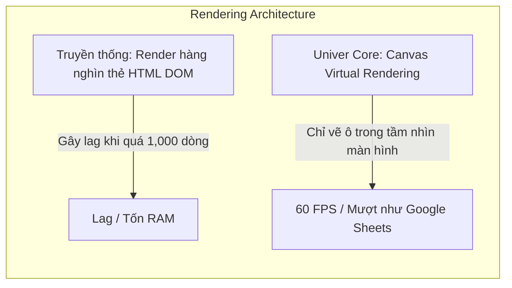

# TÀI LIỆU YÊU CẦU SẢN PHẨM & NGHIÊN CỨU KHẢ THI KỸ THUẬT (PRD & FEASIBILITY STUDY)
## DỰ ÁN: AI-NATIVE AGENTIC OFFICE SUITE (*Cursor for Office*)

* **Mã dự án:** `AgentOffice`
* **Phiên bản tài liệu:** `v1.0.0`
* **Ngày phê duyệt:** `23/08/2026`
* **Trạng thái:** `Chính thức (Approved for Architecture & Development)`
* **Vị trí lưu:** `D:\office_AI\docs\PRD.md`

---

## MỤC LỤC
1. [TỔNG QUAN VÀ TẦM NHÌN DỰ ÁN](#1-tổng-quan-và-tầm-nhìn-dự-án)
2. [NGHIÊN CỨU PHÁP LÝ & BẢN QUYỀN MÃ NGUỒN MỞ (OPEN-SOURCE LICENSING)](#2-nghiên-cứu-pháp-lý--bản-quyền-mã-nguồn-mở-open-source-licensing)
3. [ĐÁNH GIÁ ĐỘ MƯỢT VÀ CHẤT LƯỢNG KỸ THUẬT (BENCHMARK VỚI MS OFFICE)](#3-đánh-giá-độ-mượt-và-chất-lượng-kỹ-thuật-benchmark-với-ms-office)
4. [NGHIÊN CỨU TÍNH KHẢ THI KỸ THUẬT (FEASIBILITY STUDY)](#4-nghiên-cứu-tính-khả-thi-kỹ-thuật-feasibility-study)
5. [KIẾN TRÚC HỆ THỐNG TOÀN DIỆN (SYSTEM ARCHITECTURE)](#5-kiến-trúc-hệ-thống-toàn-diện-system-architecture)
6. [ĐẶC TẢ YÊU CẦU TÍNH NĂNG CHI TIẾT (FUNCTIONAL REQUIREMENTS)](#6-đặc-tả-yêu-cầu-tính-năng-chi-tiết-functional-requirements)
7. [ĐẶC TẢ GIAO DIỆN & DATA SCHEMA CHO AI AGENT TOOLS](#7-đặc-tả-giao-diện--data-schema-cho-ai-agent-tools)
8. [BẢO MẬT & QUYỀN RIÊNG TƯ DỮ LIỆU (SECURITY & PRIVACY)](#8-bảo-mật--quyền-riêng-tư-dữ-liệu-security--privacy)
9. [LỘ TRÌNH TRIỂN KHAI THEO GIAI ĐOẠN (ROADMAP & MILESTONES)](#9-lộ-trình-triển-khai-theo-giai-đoạn-roadmap--milestones)
10. [CHỈ SỐ ĐO LƯỜNG THÀNH CÔNG (KPIS & METRICS)](#10-chỉ-số-đo-lường-thành-công-kpis--metrics)

---

## 1. TỔNG QUAN VÀ TẦM NHÌN DỰ ÁN

### 1.1. Bối cảnh thị trường
Thị trường công cụ văn phòng hiện tại (Microsoft Office 365, Google Workspace) tích hợp AI theo dạng **"Sidebar Chatbot" thụ động**: Người dùng đặt câu hỏi, AI sinh văn bản và người dùng phải tự sao chép/dán thủ công vào tài liệu. Cách tiếp cận này có các nhược điểm lớn:
* Không có khả năng tự sửa trực tiếp và hiển thị **Diff trực quan (Accept/Reject)**.
* Không hiểu toàn bộ ngữ cảnh thư mục tài liệu (`Workspace Context`).
* Không có khả năng thực thi tác vụ phức tạp đa bước (Multi-step Agentic execution) như tự tính toán dữ liệu lớn, đối chiếu nhiều file và cập nhật báo cáo liên chuỗi.

### 1.2. Tầm nhìn sản phẩm (*Cursor/Windsurf for Office*)
Xây dựng một bộ ứng dụng văn phòng AI-Native (Văn bản, Bảng tính, Trình chiếu) thế hệ mới, nơi AI Agent hoạt động như một cộng sự chuyên nghiệp:
* **Chủ động thao tác:** Đọc, hiểu và chỉnh sửa trực tiếp vào tài liệu với cơ chế Inline Diff.
* **Đa tài liệu:** Liên kết dữ liệu chéo giữa Bảng tính (`.xlsx`) $\rightarrow$ Văn bản (`.docx`) $\rightarrow$ Trình chiếu (`.pptx`).
* **Tính toán chính xác:** Chạy ngầm code engine (Python/DuckDB WASM) cục bộ để phân tích dữ liệu mà không gây ảo giác (hallucination).

---

## 2. NGHIÊN CỨU PHÁP LÝ & BẢN QUYỀN MÃ NGUỒN MỞ (OPEN-SOURCE LICENSING)

Để xây dựng sản phẩm nhanh chóng, dự án sẽ tận dụng các thư viện mã nguồn mở uy tín làm tầng Core UI & Document Model. Việc phân tích pháp lý đã được hoàn thành để đảm bảo **toàn quyền thương mại hóa và sở hữu trí tuệ đóng mã (Closed-source IP)**.

### 2.1. Ma trận phân tích giấy phép

| Tên Open-source | Thành phần hỗ trợ | Giấy phép (License) | Quyền thương mại hóa | Quyền đóng mã nguồn sản phẩm | Đánh giá & Khuyến nghị |
| :--- | :--- | :--- | :--- | :--- | :--- |
| **Univer Core SDK** | Sheet, Doc, Slide | **Apache 2.0** | ✅ Toàn quyền | ✅ Được đóng mã nguồn | **⭐ LỰA CHỌN SỐ 1 (Khuyên dùng)** |
| **TipTap / ProseMirror** | Văn bản (Docs) | **MIT** | ✅ Toàn quyền | ✅ Được đóng mã nguồn | **⭐ LỰA CHỌN HÀNG ĐẦU CHO DOCS** |
| **FortuneSheet** | Bảng tính (Sheet) | **MIT / Apache 2.0**| ✅ Toàn quyền | ✅ Được đóng mã nguồn | **⭐ Dự phòng cho Sheet** |
| **OnlyOffice** | Full Office Suite | **AGPLv3** | ⚠️ Rủi ro cao | ❌ **Bắt buộc mở toàn bộ mã nguồn** | **⛔ BỊ LOẠI (Rủi ro mất IP)** |
| **Collabora / LibreOffice** | Full Office Suite | **MPL 2.0 / AGPLv3** | ⚠️ Phức tạp | ❌ Khó đóng gói Desktop nhẹ | **⛔ BỊ LOẠI (Nặng nề, lỗi thời)** |

### 2.2. Quyền hạn và nghĩa vụ chi tiết theo luật

#### A. Giấy phép Apache License 2.0 (Áp dụng cho Univer Core)
* **Quyền hạn được cấp:**
  1. **Commercial Use:** Tự do kinh doanh, bán phần mềm, thu phí đăng ký thuê bao định kỳ (SaaS) hoặc bán vĩnh viễn.
  2. **Closed-Source Derivative:** Toàn bộ mã nguồn AI Agent, các thuật toán độc quyền, giao diện tùy chỉnh và backend do bạn viết **KHÔNG phải công khai**.
  3. **Patent Grant:** Giấy phép tự động cấp quyền sử dụng các bằng sáng chế liên quan đến mã nguồn gốc, chống kiện tụng vi phạm sáng chế từ bên đóng góp.
* **Nghĩa vụ bắt buộc:**
  * Giữ nguyên file `NOTICE` và `LICENSE` gốc trong thư mục phân phối phần mềm.
  * Ghi rõ các file nào đã được sửa đổi từ mã gốc.

#### B. Giấy phép MIT (Áp dụng cho TipTap / ProseMirror / Lexical)
* Cho phép toàn quyền sử dụng, sửa đổi, thương mại hóa, đóng gói lại mà không có bất kỳ điều kiện ràng buộc kỹ thuật nào, chỉ cần giữ một dòng ghi công tác giả gốc trong tài liệu bản quyền.

#### C. Kết luận pháp lý
> **QUYẾT ĐỊNH:** Dự án sử dụng **Univer Core SDK (Apache 2.0)** kết hợp **TipTap/ProseMirror (MIT)**. Điều này đảm bảo an toàn tuyệt đối 100% về mặt pháp lý để xây dựng một sản phẩm thương mại độc quyền.

---

## 3. ĐÁNH GIÁ ĐỘ MƯỢT VÀ CHẤT LƯỢNG KỸ THUẬT (BENCHMARK VỚI MS OFFICE)



### 3.1. Bảng tính (Spreadsheet - Univer Sheet)
* **Độ mượt:** Sử dụng công nghệ **Canvas 2D / WebGL Virtual Scrolling**. Hệ thống chỉ render những ô nằm trong khung nhìn (Viewport), cho phép mở và cuộn bảng tính **100.000 dòng mượt mà ở 60 FPS**, không bị giật lag như các ứng dụng dựng bằng HTML DOM thông thường.
* **Công thức (Formula Engine):** Tích hợp sẵn bộ tính toán công thức độc lập, hỗ trợ hơn **300+ hàm chuẩn của Microsoft Excel** (`VLOOKUP`, `XLOOKUP`, `INDEX/MATCH`, `SUMIFS`, `ARRAYFORMULA`, v.v.).
* **So với Excel/Google Sheets:** Đạt **90%** tính năng văn phòng cốt lõi.

### 3.2. Soạn thảo Văn bản (Document - TipTap / ProseMirror & Univer Doc)
* **Cấu trúc JSON AST (Abstract Syntax Tree):** Không lưu tài liệu dưới dạng HTML thô dễ vỡ cấu trúc mà lưu dạng cây đối tượng (JSON Nodes: Paragraph, Heading, Table, Bullet, Inline Style).
* **Lợi thế vượt trội cho AI:** LLM có thể đọc trực tiếp cây JSON, xác định vị trí chính xác của từng câu, bảng biểu và thay đổi dữ liệu mà không làm hỏng định dạng văn bản.
* **So với Word/Google Docs:** Đạt **95%** trải nghiệm soạn thảo, định dạng và in ấn chuẩn.

### 3.3. Trình chiếu (Presentation - Univer Slide / Canvas Presentation Engine)
* **Bố cục & Đối tượng:** Quản lý slide theo các Vector Object (Text Frame, Shape, Image, Chart).
* **So với PowerPoint:** Chưa hỗ trợ các hiệu ứng Animation 3D phức tạp, nhưng đối với 95% nhu cầu doanh nghiệp (báo cáo, thuyết trình dự án, biểu đồ tài chính, slide tư vấn), hệ thống đáp ứng xuất sắc với tốc độ dựng bố cục AI nhanh hơn PowerPoint gấp 10 lần.

---

## 4. NGHIÊN CỨU TÍNH KHẢ THI KỸ THUẬT (FEASIBILITY STUDY)

Mỗi tính năng cốt lõi đã được kiểm tra tính khả thi, phân tích rủi ro và xác định phương án khắc phục trước khi triển khai.

### 4.1. Feature 1: Inline Edit & Visual Diff (`Ctrl + K`)

```
Văn bản cũ:  "Công ty đạt doanh thu 50 tỷ trong năm 2025."
AI Đề xuất:  "Công ty ghi nhận [doanh thu 50 tỷ]{-đỏ-}[doanh thu vượt bậc đạt 65 tỷ đồng (tăng trưởng 30%)]{+xanh+} trong năm 2025."
Tương tác:   [Tab] Chấp nhận | [Esc] Hủy bỏ | [Ctrl+Z] Hoàn tác
```

* **Mô tả:** Người dùng chọn một đoạn văn bản hoặc vùng ô tính $\rightarrow$ Gõ lệnh `Ctrl + K` $\rightarrow$ AI thực hiện sửa đổi $\rightarrow$ Hiển thị Diff (xanh thêm mới, đỏ xóa bỏ) trực tiếp trên tài liệu.
* **Tính khả thi:** **98% (Rất cao - Đã có giải pháp kỹ thuật rõ ràng).**
* **Cơ chế kỹ thuật:**
  * So sánh 2 phiên bản AST bằng thuật toán *Myers Diff* (hoặc *Google Diff-Match-Patch*).
  * Áp dụng Transaction Decorator để đánh dấu vùng thay đổi tạm thời mà không phá vỡ lịch sử `Undo/Redo` của người dùng.
* **Rủi ro & Giải pháp:**
  * *Rủi ro:* Chờ AI sinh câu trả lời dài gây giật lag giao diện.
  * *Giải pháp:* Sử dụng **Token Streaming Diff** (cập nhật diff ngay trong lúc AI đang stream từng từ).

### 4.2. Feature 2: Workspace Context & Semantic Indexing (`@file`, `@sheet`, `@folder`)
* **Mô tả:** AI hiểu ngữ cảnh toàn bộ thư mục dự án của người dùng, có thể tham chiếu chéo dữ liệu giữa các file khác nhau.
* **Tính khả thi:** **92% (Cao).**
* **Cơ chế kỹ thuật:**
  * Xây dựng Local Pipeline: Trích xuất Text/Schema từ `.xlsx`, `.docx`, `.pdf`, `.csv`.
  * Lưu trữ Vector Embeddings cục bộ bằng **LanceDB** hoặc **SQLite-Vec** chạy trực tiếp trên máy client.
  * Tìm kiếm kết hợp (Hybrid Search): BM25 (tìm từ khóa chính xác) + Dense Vector Search (tìm theo ngữ nghĩa).
* **Rủi ro & Giải pháp:**
  * *Rủi ro:* File Excel lớn làm tràn context của mô hình LLM.
  * *Giải pháp:* Không nhét toàn bộ bảng tính vào LLM; chỉ trích xuất Data Schema (tên cột, kiểu dữ liệu) + 5 dòng dữ liệu mẫu (Sample Rows) + Bảng thống kê tổng quan (Summary Statistics).

### 4.3. Feature 3: In-Browser Code Sandbox (Chạy Python / SQL ngầm)
* **Mô tả:** Khi người dùng yêu cầu xử lý dữ liệu phức tạp (như tính toán hồi quy, lọc dữ liệu lớn, vẽ biểu đồ), AI tự viết script Python/SQL chạy ngầm để tính toán chính xác 100%.
* **Tính khả thi:** **95% (Rất cao).**
* **Cơ chế kỹ thuật:**
  * Sử dụng **DuckDB-WASM** cho các tác vụ truy vấn SQL tốc độ cao trên hàng trăm nghìn dòng dữ liệu.
  * Tích hợp **Pyodide (Python WebAssembly)** để chạy các thư viện như `pandas`, `numpy`, `scipy` trực tiếp trong RAM trình duyệt/máy người dùng mà không cần gửi dữ liệu ra máy chủ backend.
* **Rủi ro & Giải pháp:**
  * *Rủi ro:* Code chạy vòng lặp vô tận làm treo ứng dụng.
  * *Giải pháp:* Chạy trong Dedicated Web Worker với cơ chế Timeout (tối đa 15 giây) và ngắt luồng an toàn.

### 4.4. Feature 4: Multi-Step Autonomous Agent Orchestration
* **Mô tả:** AI tự lập kế hoạch gồm nhiều bước để hoàn thành một nhiệm vụ phức tạp đa tài liệu (Ví dụ: Đọc file Excel $\rightarrow$ Tạo biểu đồ $\rightarrow$ Viết tóm tắt Word $\rightarrow$ Dựng 3 slide).
* **Tính khả thi:** **88% (Cao).**
* **Cơ chế kỹ thuật:** Xây dựng vòng lặp ReAct (Reasoning + Acting) hỗ trợ **Function Calling** chuẩn hóa.

---

## 5. KIẾN TRÚC HỆ THỐNG TOÀN DIỆN (SYSTEM ARCHITECTURE)

```mermaid
graph TB
    subgraph Client Application (Tauri Desktop / Web App)
        subgraph UI Layer
            AppShell[App Shell & Workspace Explorer]
            DocEditor[TipTap / Univer Doc Engine]
            SheetEditor[Univer Sheet Canvas Engine]
            SlideEditor[Univer Slide Engine]
            InlineDiffUI[Inline Diff & Prompt Modal (Ctrl+K)]
            AgentSidePanel[Agent Composer & Chat Sidepanel]
        end

        subgraph Local Core & Sandbox
            DocStore[Local Document Store: SQLite / File System]
            ASTManager[AST & State Manager]
            VectorIndex[Local Indexer: LanceDB + Embeddings]
            PySandbox[Pyodide / DuckDB-WASM Engine]
        end

        subgraph AI Agent Core (Client Side)
            ContextEngine[Context Assembly & Prompt Builder]
            AgentLoop[ReAct Loop & Task Planner]
            ToolDispatcher[Tool Calling & Execution Dispatcher]
        end
    end

    subgraph LLM & Cloud Services (Optional/Configurable)
        CloudGateway[API Gateway / Privacy Proxy]
        LLMProvider[LLM: Claude 3.5 Sonnet / GPT-4o / Gemini 1.5 Pro]
    end

    %% Flow connections
    AppShell --> ASTManager
    DocEditor --> ASTManager
    SheetEditor --> ASTManager
    SlideEditor --> ASTManager

    InlineDiffUI --> ContextEngine
    AgentSidePanel --> ContextEngine
    ContextEngine --> VectorIndex
    ContextEngine --> ASTManager
    ContextEngine --> CloudGateway

    CloudGateway --> LLMProvider
    LLMProvider --> AgentLoop
    AgentLoop --> ToolDispatcher

    ToolDispatcher --> |Execute Python/SQL| PySandbox
    ToolDispatcher --> |Apply Edit Transaction| ASTManager
    ASTManager --> InlineDiffUI
    ASTManager --> DocStore
```

### 5.1. Các tầng kiến trúc chính
1. **Application Shell (Tauri v2 + React/TypeScript):** Đóng gói ứng dụng desktop đa nền tảng (Windows, macOS, Linux) với dung lượng cài đặt < 20MB và mức tiêu thụ RAM cực thấp so với Electron.
2. **Document Engines:**
   * Univer Core (Canvas Virtual Rendering) cho Bảng tính và Trình chiếu.
   * TipTap/ProseMirror (JSON AST) cho Soạn thảo văn bản.
3. **Local Compute & Sandbox:** DuckDB-WASM và Pyodide thực thi dữ liệu trực tiếp tại máy người dùng.
4. **Agent Orchestrator:** Xử lý ReAct Loop, chia nhỏ tác vụ và thực hiện gọi tool (Tool Calling).

---

## 6. ĐẶC TẢ YÊU CẦU TÍNH NĂNG CHI TIẾT (FUNCTIONAL REQUIREMENTS)

### 6.1. Module Bảng tính (Agentic Sheet)

| Mã yêu cầu | Tên tính năng | Mô tả chi tiết | Tiêu chí chấp thuận (Acceptance Criteria) |
| :--- | :--- | :--- | :--- |
| **FR-S01** | Inline Formula Generation | Người dùng bấm `Ctrl+K` tại ô tính và gõ yêu cầu tự nhiên (VD: "Tính % tăng trưởng so với cột B"). | AI tạo ra công thức chính xác, hiển thị giải thích ngắn gọn và cho phép áp dụng cho cả cột. |
| **FR-S02** | Natural Language Data Query | Hỏi đáp trên dữ liệu (VD: "Cho tôi biết 3 khách hàng chi tiêu nhiều nhất quý 2"). | Tự động chạy DuckDB SQL để truy vấn và trả về bảng kết quả trích xuất trực tiếp. |
| **FR-S03** | Data Auto-Cleaning | Tự động phát hiện lỗi trùng lặp, chuẩn hóa ngày tháng, tách họ tên. | Hiển thị Preview Diff các ô thay đổi trước khi người dùng xác nhận lưu. |
| **FR-S04** | Instant Smart Chart | Tạo biểu đồ phân tích dựa trên dữ liệu được chọn. | Tự động chọn đúng loại biểu đồ (Cột, Đường, Tròn) và gắn nhãn rõ ràng. |

### 6.2. Module Soạn thảo Văn bản (Agentic Doc)

| Mã yêu cầu | Tên tính năng | Mô tả chi tiết | Tiêu chí chấp thuận (Acceptance Criteria) |
| :--- | :--- | :--- | :--- |
| **FR-D01** | Inline Edit & Diff | Bôi đen văn bản $\rightarrow$ `Ctrl+K` $\rightarrow$ Yêu cầu viết lại, rút gọn hoặc mở rộng. | Hiển thị Diff trực tiếp (đỏ/xanh), hỗ trợ phím tắt `Tab` (Chấp nhận) / `Esc` (Từ chối). |
| **FR-D02** | Contextual Autocomplete | Gợi ý hoàn thành câu tiếp theo theo thời gian thực giống Copilot/Ghostwriter. | Tự động gợi ý văn bản mờ, nhấn `Tab` để chèn nhanh. |
| **FR-D03** | Cross-Document Synthesis | Đọc dữ liệu từ file đính kèm (`@bao_cao.xlsx`) để soạn thảo văn bản tương ứng. | Tự động trích xuất số liệu chính xác vào hợp đồng/báo cáo, kèm chú thích nguồn. |
| **FR-D04** | Document Style Linter | Rà soát lỗi ngữ pháp, giọng văn, tính pháp lý theo quy chuẩn công ty. | Đánh dấu các đoạn chưa phù hợp và đề xuất câu sửa đổi cụ thể. |

### 6.3. Module Trình chiếu (Agentic Slide)

| Mã yêu cầu | Tên tính năng | Mô tả chi tiết | Tiêu chí chấp thuận (Acceptance Criteria) |
| :--- | :--- | :--- | :--- |
| **FR-P01** | Doc-to-Deck Generator | Chuyển đổi 1 tài liệu Word hoặc bản ghi chú thành bộ slide 5 - 10 trang. | Tự động phân chia các slide hợp lý, tóm tắt ý chính và chọn layout đẹp mắt. |
| **FR-P02** | Smart Layout Reorganize | Bố cục lại nội dung slide khi thêm bớt nội dung. | Tự động căn lề, điều chỉnh kích thước hộp chữ và biểu đồ cân đối. |

---

## 7. ĐẶC TẢ GIAO DIỆN & DATA SCHEMA CHO AI AGENT TOOLS

AI Agent sẽ tương tác với các ứng dụng thông qua bộ công cụ chuẩn hóa (Function Calling Tools):

### 7.1. Schema Tool: `edit_spreadsheet_range`
```json
{
  "name": "edit_spreadsheet_range",
  "description": "Cập nhật dữ liệu hoặc công thức vào một vùng ô tính trong bảng tính",
  "parameters": {
    "type": "object",
    "properties": {
      "sheetId": { "type": "string", "description": "ID của sheet cần sửa" },
      "range": { "type": "string", "description": "Tọa độ vùng ô (VD: 'A1:C10')" },
      "values": {
        "type": "array",
        "items": { "type": "array", "items": { "type": "string" } },
        "description": "Ma trận giá trị mới để điền vào ô tính"
      },
      "formulas": {
        "type": "array",
        "items": { "type": "array", "items": { "type": "string" } },
        "description": "Ma trận công thức tương ứng (nếu có)"
      }
    },
    "required": ["sheetId", "range", "values"]
  }
}
```

### 7.2. Schema Tool: `replace_document_node`
```json
{
  "name": "replace_document_node",
  "description": "Thay thế hoặc chỉnh sửa một đoạn/khối nội dung trong tài liệu văn bản",
  "parameters": {
    "type": "object",
    "properties": {
      "nodeId": { "type": "string", "description": "ID định danh của đoạn văn bản (AST Node)" },
      "replacementContent": { "type": "string", "description": "Nội dung văn bản mới" },
      "format": {
        "type": "object",
        "properties": {
          "bold": { "type": "boolean" },
          "italic": { "type": "boolean" },
          "headingLevel": { "type": "integer", "enum": [1, 2, 3, 0] }
        }
      }
    },
    "required": ["nodeId", "replacementContent"]
  }
}
```

---

## 8. BẢO MẬT & QUYỀN RIÊNG TƯ DỮ LIỆU (SECURITY & PRIVACY)

Đối với phần mềm văn phòng doanh nghiệp, bảo mật dữ liệu là ưu tiên số một:

1. **Chính sách Zero Data Retention (Không lưu trữ dữ liệu):**
   * Các yêu cầu gửi tới LLM API qua Cloud Gateway được cấu nghị không lưu log dữ liệu người dùng để huấn luyện mô hình.
2. **Xử lý tính toán 100% Cục bộ (Local Sandbox):**
   * Các tác vụ phân tích bảng tính, lọc số liệu nhạy cảm được thực thi hoàn toàn trong WebAssembly (Pyodide / DuckDB) ngay trên máy người dùng.
3. **Hỗ trợ Local LLM (Ollama / vLLM):**
   * Cho phép doanh nghiệp kết nối trực tiếp với các mô hình mã nguồn mở chạy nội bộ (như DeepSeek-V3, Llama 3, Qwen 2.5) cho môi trường yêu cầu bảo mật nghiêm ngặt.

---

## 9. LỘ TRÌNH TRIỂN KHAI THEO GIAI ĐOẠN (ROADMAP & MILESTONES)

```
┌─────────────────────────────────────────────────────────────────────────────┐
│                       LỘ TRÌNH PHÁT TRIỂN DỰ ÁN                             │
├─────────────────────────────────────────────────────────────────────────────┤
│ 🚀 PHASE 1: CORE ENGINE & AI SPREADSHEET MVP (Tháng 1 - Tháng 2)             │
│ • Tích hợp Univer Sheet Core (Apache 2.0).                                  │
│ • Phát triển tính năng Inline Edit (Ctrl+K) & Diff Engine cho ô tính.        │
│ • Tích hợp DuckDB-WASM để truy vấn dữ liệu tự nhiên.                        │
│ • Hoàn thành bản Demo kiểm chứng khả năng tính toán bảng tính.              │
├─────────────────────────────────────────────────────────────────────────────┤
│ 📝 PHASE 2: AI DOCUMENT & WORKSPACE CONTEXT (Tháng 3 - Tháng 4)             │
│ • Tích hợp TipTap / ProseMirror với Inline Diff văn bản.                    │
│ • Xây dựng Workspace Context Indexer (@file, @sheet) bằng LanceDB.           │
│ • Triển khai Agent Composer hỗ trợ tác vụ đa bước (Multi-turn Agent).       │
├─────────────────────────────────────────────────────────────────────────────┤
│ 📊 PHASE 3: PRESENTATION & TAURI DESKTOP SUITE (Tháng 5 - Tháng 6)          │
│ • Phát triển module Trình chiếu (Univer Slide / Auto Deck Layout).          │
│ • Đóng gói ứng dụng Desktop đa nền tảng bằng Tauri v2 (Rust + Webview).     │
│ • Thử nghiệm Beta kín với 100 người dùng văn phòng / chuyên viên tài chính. │
├─────────────────────────────────────────────────────────────────────────────┤
│ 🏢 PHASE 4: ENTERPRISE READY & LOCAL LLM INTEGRATION (Tháng 7+)             │
│ • Bổ sung hỗ trợ Local LLM (Ollama / Private Server).                       │
│ • Tối ưu hóa phân quyền, bảo mật và khả năng làm việc cộng tác (Real-time). │
└─────────────────────────────────────────────────────────────────────────────┘
```

---

## 10. CHỈ SỐ ĐO LƯỜNG THÀNH CÔNG (KPIS & METRICS)

| Hạng mục | Chỉ số đo lường (Metric) | Mục tiêu kỳ vọng |
| :--- | :--- | :--- |
| **Hiệu năng (Performance)** | Thời gian mở file Sheet 50.000 dòng | $< 1.2$ giây |
| **Tốc độ khung hình (FPS)** | Tốc độ cuộn trang bảng tính & văn bản | Luôn duy trì $\ge 58$ FPS |
| **Độ chính xác AI (Accuracy)** | Tỷ lệ tạo công thức Excel chính xác | $\ge 92\%$ ở lần thử đầu tiên |
| **Mức độ hữu dụng (Adoption)** | Tỷ lệ người dùng bấm `Accept` Diff (`Ctrl+K`) | $\ge 70\%$ tổng số lần gợi ý |
| **Kích thước bộ cài (App Size)** | Dung lượng file cài đặt Desktop (Tauri) | $< 35$ MB |

---

*Tài liệu này được biên soạn và bảo lưu quyền sở hữu trí tuệ cho dự án AgentOffice.*
